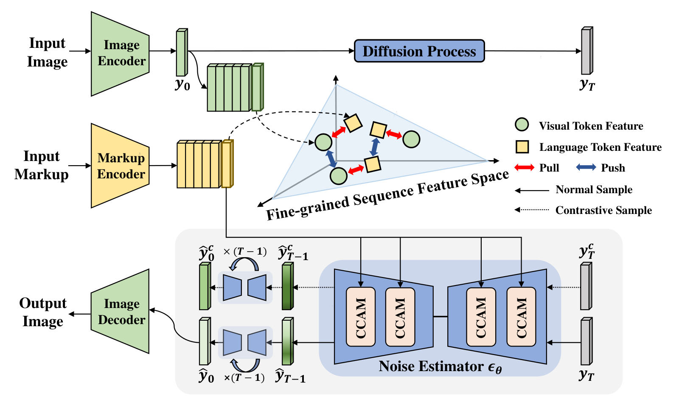

# FSA-CDM

PyTorch implementation of [Contrast-augmented Diffusion Model with Fine-grained Sequence Alignment for Markup-to-Image Generation](https://doi.org/10.1145/3581783.3613781) (ACM MM 2023).

Includes sequence alignment, contrast-augmented diffusion, and context-aware cross attention for Math, Simple Tables, Sheet Music, and Molecules.

[Paper (PDF)](assets/FSA-CDM.pdf) · [Framework (PDF)](assets/Framework.pdf)

## Abstract

Markup-to-image generation requires precise rendering of structured markup, with low tolerance for symbol errors and complex sequence and contextual relationships between text and images. FSA-CDM combines fine-grained sequence alignment with contrast-augmented diffusion to address these challenges. A cross-modal alignment module learns the correspondence between visual and language token sequences. A contrastive variational objective incorporates positive and negative samples to encourage semantic consistency and improve generalization. During denoising, a context-aware cross attention module captures both character-level associations and contextual relationships within the markup. The framework supports mathematical formulas, HTML tables, sheet music, and molecular diagrams.

## Framework



*Figure 2 from the paper.*

1. **Fine-grained sequence alignment.** A visual encoder and Bi-LSTM produce contextual visual tokens. Cross attention aligns these with markup embeddings, and a sequence-level alignment loss encourages matching token representations.
2. **Contrast-augmented diffusion.** The model learns from the original image, a mildly augmented positive view, and negative images from the same batch. The objective combines denoising, alignment, and contrastive terms.
3. **Context-aware cross attention (CCAM).** Character-aware attention links image regions to markup tokens, while context-aware attention uses visual relations and joint visual–textual memory to guide noise prediction.

At inference, the denoiser generates an image from Gaussian noise conditioned on the markup. Ground-truth images are used for training and evaluation, not as generation inputs.

## Installation

Use Python 3.10–3.12. A CUDA GPU is recommended.

```bash
python -m venv .venv
source .venv/bin/activate
pip install -e .
```

## Usage

Run data download, preparation, training, and evaluation:

```bash
CUDA_VISIBLE_DEVICES=0 bash scripts/pipeline.sh math runs/math
```

Replace `math` with `tables`, `music`, or `molecules`. Configurations are in `configs/`. Downloads use Hugging Face; set `HF_ENDPOINT` to use a mirror. For multiple GPUs, set `NUM_GPUS` and `CUDA_VISIBLE_DEVICES`.

Run individual stages:

```bash
python scripts/download.py --dataset math
python -m fsa_cdm.run prepare --dataset math \
  --parquet-dir assets/math/data --output data/math
python -m fsa_cdm.run train --config configs/math.json \
  --data data/math --output runs/math
python -m fsa_cdm.run generate --checkpoint runs/math/latest.pt \
  --data data/math --output runs/math/evaluation --steps 1000
```

## Acknowledgements

We thank [Yuntian Deng et al.'s Markup-to-Image Diffusion Models](https://github.com/da03/markup2im) for the reference codebase, datasets, and evaluation protocol, and [Hugging Face Diffusers](https://github.com/huggingface/diffusers), [Transformers](https://github.com/huggingface/transformers), and [Accelerate](https://github.com/huggingface/accelerate) for the underlying libraries. The original MIT copyright notice is retained in [LICENSE](LICENSE).

## Citation

```bibtex
@inproceedings{zhong2023fsacdm,
  title={Contrast-augmented Diffusion Model with Fine-grained Sequence Alignment for Markup-to-Image Generation},
  author={Zhong, Guojin and Yuan, Jin and Wang, Pan and Yang, Kailun and Guan, Weili and Li, Zhiyong},
  booktitle={Proceedings of the 31st ACM International Conference on Multimedia},
  year={2023},
  doi={10.1145/3581783.3613781}
}
```
